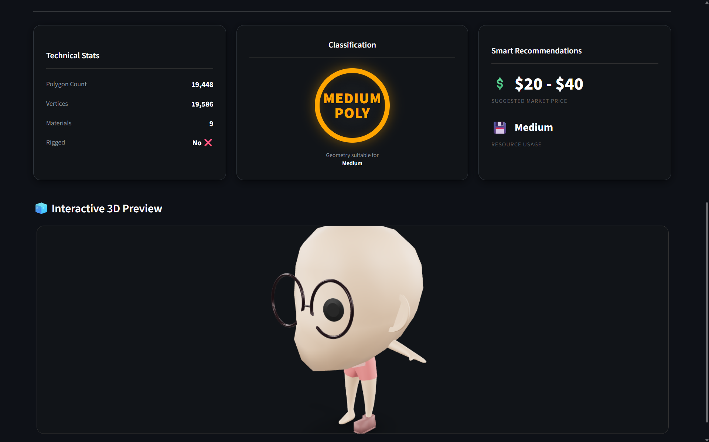
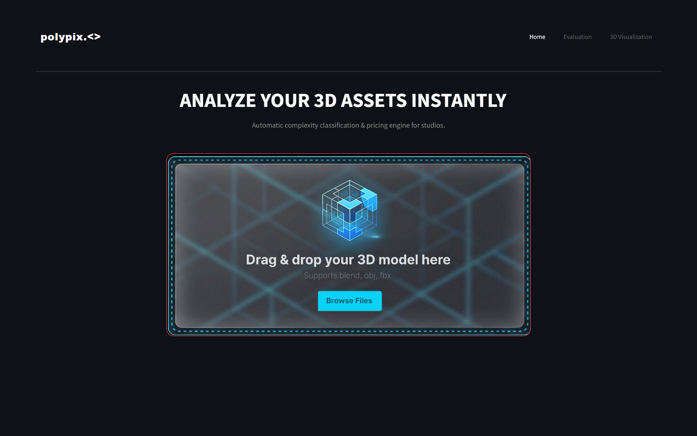

  <!--  -->
  
  <h1>🧊 PolyPix AI</h1>
  
  

    <strong>Intelligent 3D Asset Analyzer & Valuation Engine</strong>
  

  

    🔍 <strong>Deep Geometry Analysis</strong> | 
    🧠 <strong>Native KNN Algorithm</strong> | 
    💰 <strong>Smart Pricing</strong>
  

   
  
  

    <a href="#-fitur-unggulan">Fitur</a> •
    <a href="#-teknologi">Teknologi</a> •
    <a href="#-instalasi">Instalasi</a> •
    <a href="#-cara-penggunaan">Cara Pakai</a>
  

  
   
  
<em>Tampilan Dashboard Utama: Upload & Analisis 3D Real-Time</em>

 

## 📝 Tentang Proyek

**PolyPix AI** adalah sistem analisis cerdas untuk aset 3D yang menggabungkan kekuatan **Machine Learning** dengan **Computer Graphics**. Alat ini dirancang untuk membantu 3D Artist dan Studio Game dalam melakukan *Quality Control* (QC) terhadap aset 3D mereka.

Berbeda dengan tools biasa, PolyPix AI menggunakan algoritma **K-Nearest Neighbors (KNN)** yang dibangun secara **Native (Tanpa Library Scikit-Learn)** untuk mengklasifikasikan kompleksitas objek (*Low/Medium/High Poly*) dan memberikan estimasi harga pasar berdasarkan standar **Sketchfab Store**.

---

## ✨ Fitur Unggulan

<table>
  <tr>
    <td width="50%">
      <h3>🧠 Native AI Core</h3>
      
Algoritma klasifikasi KNN ditulis manual dari nol (from scratch) untuk transparansi logika dan performa ringan.

    </td>
    <td width="50%">
      <h3>💰 Sketchfab Pricing Standard</h3>
      
Estimasi harga otomatis yang mengacu pada standar kualitas visual dan pasar Sketchfab Store.

    </td>
  </tr>
  <tr>
    <td width="50%">
      <h3>📐 Deep Geometry Scan</h3>
      
Menganalisis hingga ke akar: Polygon Count, Vertex Count, Material Slots, Texture Nodes, hingga Rigging.

    </td>
    <td width="50%">
      <h3>📊 Live Evaluation System</h3>
      
Fitur pengujian model real-time dengan Confusion Matrix untuk memvalidasi akurasi prediksi.

    </td>
  </tr>
</table>

---

## 🛠️ Teknologi

Project ini dibangun menggunakan stack teknologi berikut:

* **Frontend:** [Streamlit](https://streamlit.io/) (Python Web Framework)
* **Backend Processing:** [Blender API (bpy)](https://www.blender.org/)
* **Machine Learning:** Native Python (Math & JSON)
* **Visualization:** Matplotlib & Google Model Viewer

---

## 💻 Instalasi

Pastikan Anda telah menginstal **Python 3.8+** dan **Blender 3.x / 4.x**.

### 1. Clone Repository

git clone [https://github.com/username-anda/polypix-ai.git](https://github.com/username-anda/polypix-ai.git)
cd polypix-ai
 
2. Install Dependencies

Bash

pip install streamlit matplotlib trimesh
 
3. Setup Dataset (Opsional)
Jika ingin melatih ulang model:

Bash

python desain/mining_objaverse.py  # Download data
python desain/data_splitter.py     # Bagi data train/test
 
🚀 Cara Penggunaan
Langkah 1: Jalankan Aplikasi
Buka terminal dan ketik perintah berikut:

Bash

streamlit run desain/app.py
 
Langkah 2: Konfigurasi Path Blender (Wajib!)
Pada sidebar di sebelah kiri aplikasi, masukkan lokasi file .exe Blender di komputer Anda.

Contoh: C:\Program Files\Blender Foundation\Blender 3.6\blender.exe
 
Langkah 3: Upload & Analisis
Upload file .blend atau .obj, lalu klik tombol 🚀 RUN ANALYSIS.

<em>Hasil Output: Klasifikasi Geometri & Rekomendasi Harga</em>
 

